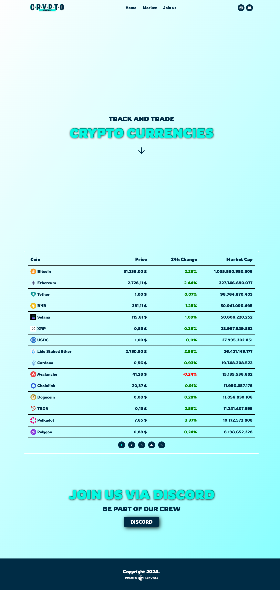

# CryptoView

A cryptocurrency exchange platform that provides real-time value tracking of various cryptocurrencies, complemented by data visualization in the form of interactive charts.

## Live Demo

👉 [Live Demo](https://preeminent-cascaron-a5b8a3.netlify.app/)

## Tech Stack:

- React
- SCSS
- RESTful Api / CoinGecko

## Screenshots 📸

